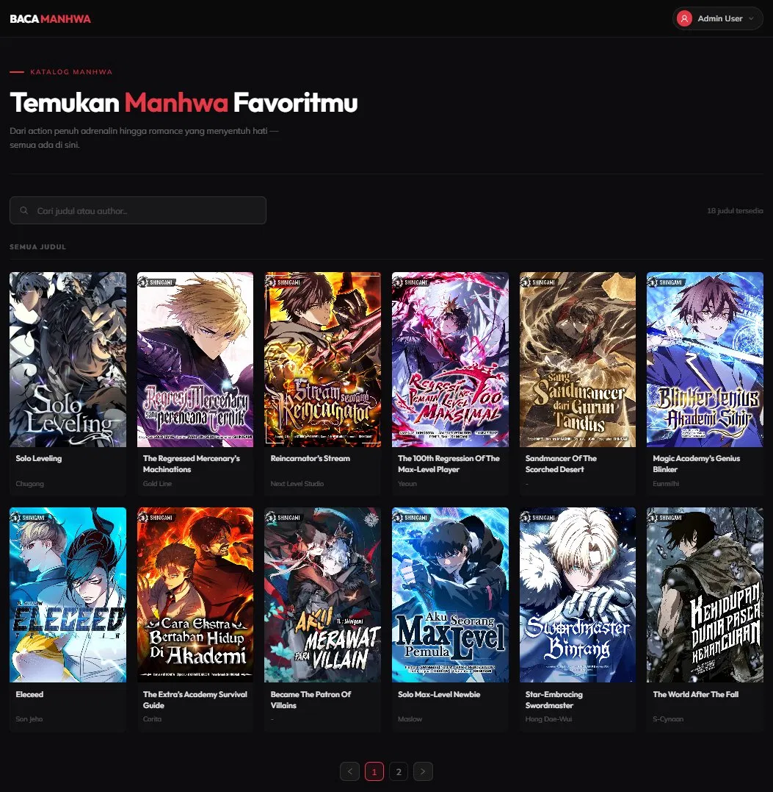
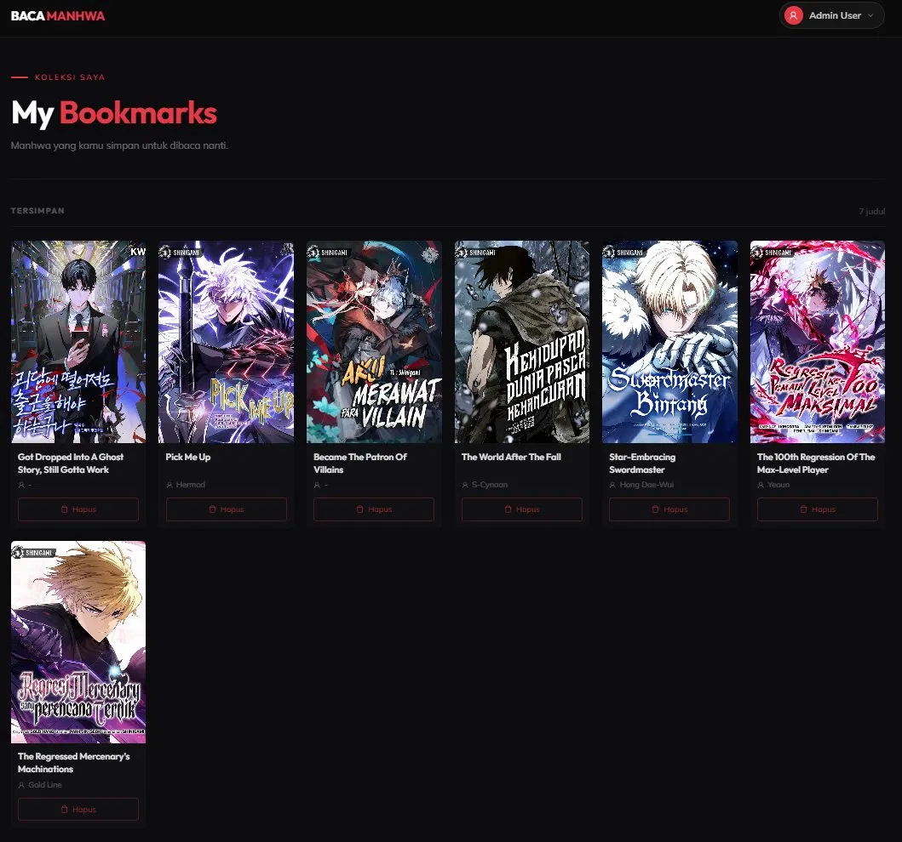
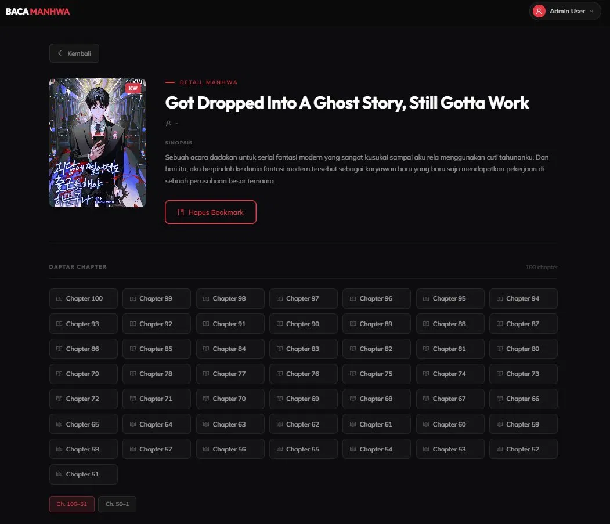
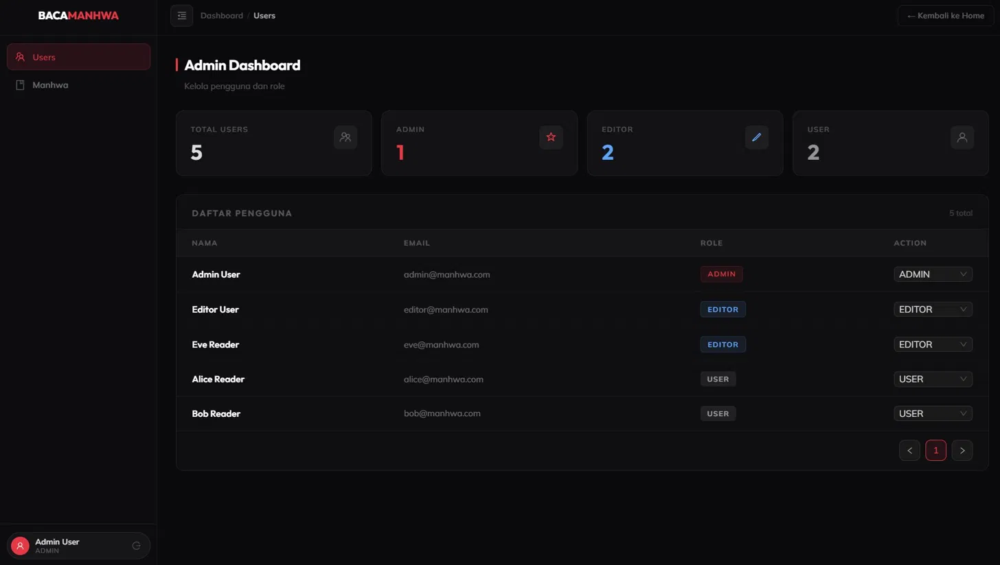
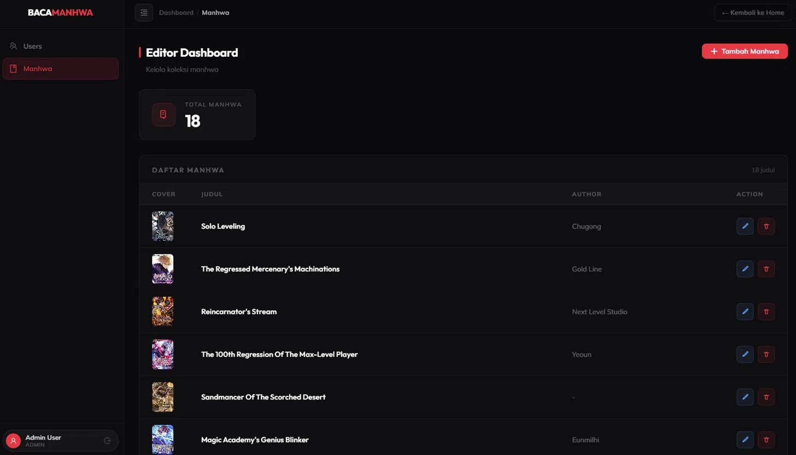

# 🗂️ BacaManhwa — Monorepo

Full-stack aplikasi katalog manhwa untuk keperluan onboarding.

## Struktur Project

```
BACA_MANHWA/
├── docs/              # Screenshot preview
├── backend/           # NestJS REST API + PostgreSQL
├── frontend/          # React + Vite + TailwindCSS
└── docker-compose.yml
```

## 📸 Preview

### Katalog Manhwa


### Bookmarks


### Detail Manhwa


### Admin Dashboard


### Editor Dashboard


## 🚀 Quick Start (Docker)

```bash
# Clone repo, lalu jalankan semua service sekaligus
docker-compose up -d

# Seed database (jalankan sekali setelah container up)
docker-compose exec api npm run seed
```

| Service  | URL                            |
|----------|--------------------------------|
| Frontend | http://localhost:5173          |
| API      | http://localhost:3000/api/v1   |
| Swagger  | http://localhost:3000/api/docs |

## 📄 Dokumentasi Lengkap

- [Backend README](./backend/README.md)
- [Frontend README](./frontend/README.md)


